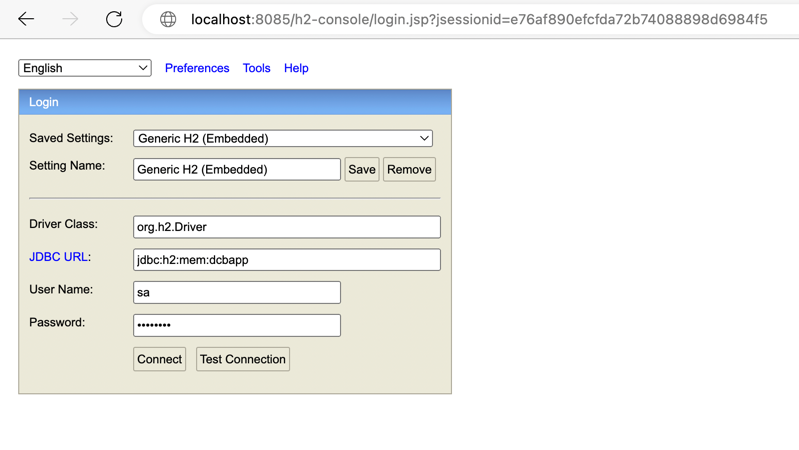

#Default setup

1)Need to create below two folders inside Documents folder. 
a)InputData  
b)ProcessedData

2)Transaction upload and processed file location is in Documents folder , we can change this location as well.  

input file location /Documents/InputData/  

output file location /Documents/ProcessedData/  

3)SampleTransactionFile.csv file is exist in project root folder. 

4)To execute application as jar file with arguments servicename inputfilename outputfilename  
java -jar target/kp-health-batch-scheduler-0.0.1-SNAPSHOT.jar CommandLineJobRunner com.kp.spring.batch.scheduler.config.SchedulerJobConfiguration processTransaction  inputTransactionFile.csv outputTransactionFile.csv

5)To execute application as mvn command  with arguments servicename inputfilename outputfilename  
mvn spring-boot:run -Dspring-boot.run.arguments="processTransaction  inputTransactionFile.csv outputTransactionFile.csv"

6)For batch processing scheduler is scheduled for every 30 minutes to pick the file from input transaction processing location 
and its should be named as batchTransactionFile.csv and once its processed its name will be batchTransactionProcessedFile.csv

7)Local host url and port  
http://localhost:8085/

8)Web service details :  

a)To get family accumulated deductible ,please use below curl url or request  

http://localhost:8085/getFamilyAccumulatedDeductible?policyId=100002   

b)To get individual accumulated deductible ,please use below curl url or request   

http://localhost:8085/getIndividualAccumulatedDeductible?policyId=100082&policyHolderId=1000011  

9)For uploading a file using GUI   

after clicking on http://localhost:8085/upload   

please upload a file .  

10)For batch processing execution using scheduler , please put file into /Documents/InputData/ folder with name batchTransactionFile.csv  

11)Database used H2 database and ORM JPA .  

12)SpringBoot technology is used .  

13)SpringBatch is used for batch processing . 

14)Rest API is used for web-service calls . 

15)For view purpose thymeleaf templates are used . 

16)Java programming version 8 is used in this project . 

17)Below database tables are used and created for this project . 
Default database tables are created using data.sql file , which is exist under resource folder .

Tables : 
1)PLAN_DESCRIPTIONS  
2)PLAN_COVERAGE  
3)POLICY_DATA  
4)PROCESSED_TRANSACTION_DETAILS  

18)To connect with database please use below url . 
http://localhost:8085/h2-console/  

Please use below details to connect with database . 

JDBC URL: jdbc:h2:mem:dcbapp   
User Name: sa  
Password: password  

